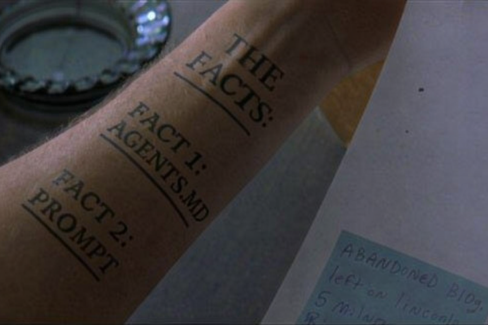

# AI rage

A recent example of my conversation with AI:

> ARE YOU F****** KIDDING ME
memories.ts#L655-703
> WHY DOES THIS FUNCTION STILL EXIST
> 
> AGAIN
> * TAKE THE F****** RAW DATA
> * DO THE EXTRACTION OF CONTEXT WITH THAT RAW DATA
> * NO INTERMEDIATE SUMMARY STEPS

It all started out calm and peacefully
> my friend, I think something went wrong, we were supposed to mimic the memory implementation from openclaw (see folder in your workspace) in memories.ts but it seems like we didn't really. we just tried to retrofit markdown files in ourexisting system. Please familiarize yourself with how memories owrk in openclaw and then help draft a better approach. The key differences are [...]

But then somehow ten messages later I am raging. Why is that?

### I am not alone

I did some sanity checks. Turns out I'm not an abusive psychopath (I think). Lots of other people reporting this

[I've been insulting AI every day (reddit)](https://www.reddit.com/r/ClaudeCode/comments/1qvunta/ive_been_insulting_ai_every_day_and_calling_the/_), [I can't stop yelling at claude code (blog)](https://www.theargumentmag.com/p/i-cant-stop-yelling-at-claude-code), [AI rage (reddit)](https://www.reddit.com/r/ArtificialInteligence/comments/1p3xbqu/ai_rage/), [Some good profanity screenshots (x)](https://x.com/clankercode/status/2021008792801177776), [Claude code = worst intern ever (x)](https://x.com/Grady_Booch/status/2016619898282414417), [This is not fun anymore (x)](https://x.com/MarcJSchmidt/status/2018272989788193124), "Opus 4.6 was gaslighting me today" - Random sales call I was on today

## Causes

I don't want to be angry. I know it's not helping. Yet here I am. Why does this keep happening? I think a reasonable analogy are managers getting mad at employees. Most probably don't enjoy it and still they do it. I think the same mechanisms apply here, just without the social norms and with even less competent employees.

### Learnt behavior

Pressuring employees can lead to short-term gains. The problem with AI: They are only ever short term and have no long-term memory. So insulting always works. When something always works we slowly learn to do it. Reinforcement learning at it's best. Some sources: [A 2025 study that shows insulting leads to 10% higher accuracy](https://www.arxiv.org/pdf/2510.04950) [Another one](https://www.ijcai.org/proceedings/2024/0719.pdf) [And one more](https://arxiv.org/abs/2409.17167)

### Anthropomorphism

You know that manger that just assumes you know what they know? Have the skills they have? Magically can read their mind? The same happens with AIs, just on steroids. Employees learn every day. Agents never learn. I notice that I get especially agnry when the AI makes similar mistakes multiple times.

### Unrealistic expectations

Probable one of the most common reasons managers get angry: They expect more of their employees than they deliver. Remember how Sam Altman said we'd get [PhD Level Intelligence](https://www.bbc.com/news/articles/cy5prvgw0r1o). I assume a PhD level person has memory that spans more than five minutes. You see everybody talking about how they one-shot-vibe-coded a browser from scratch and you wonder what's wrong with you that you can't get your AI to move a button to the right.

### Stress

Your manager is most abusive when under pressure, same applies here. When you are under pressure to fix something and AI makes stupid mistakes you'll be less forgiving. Managers get more emotional the longer the day is and the more their willpower is depleted from tons of reviewing and decision making. It's the same with AIs.

## Fixes

Yes, insulting your AI can lead to better outcomes, but you know what can lead to even better outcomes?

### Empathy with the AI


Image from [this great article](https://ferd.ca/the-gap-through-which-we-praise-the-machine.html) on agenting programming

In general, accept the key limitations of AI, namely:
* They start from scratch every single time without any context and they always read the full conversation before answering your next message.
* They have been trained to always take the fastest path because their context window is limited.
* Because of this they are also an eager yes-man just wanted to push forward without questioning.
* They work best on standard and average use cases and will always suggest the average.

Internalize them and don't hope for anything else.

### Care for your AI



Imagine yourself waking up in a room. No orientation. Only endless cabinets of code, badly labeled. And somebody shouting at you "center the div". Some instinct is telling you that you only have 10 minutes to live before you forget again so you better be quick. But which div? Where to even start looking? This feels a lot like Memento, so be kind to your agent, give them some tattoos to start with:
* Have a good AGENTS.md. Agent doing something stupid? Ask it to update AGENTS.md to do it better next time
* Choose standard average technology. They know it best.
* Choose standard average designs. Otherways you'll always have to push them back.
* Structure your project well. Trust your AIs choices because those will be the places it'll intuitively look in.
* Name your files and variables with meaningful names. The names suggested by the AI will be the one it'll intuitively look for.
* Document thoroughly. Finished with a task? Ask your AI to write documentation.
* Avoid complexity. Always challenge AIs for simplicity. Done with a task? Ask your AI to do the same thing but easier. Refactor.
* Automate tests and security reviews. It's never been easier to write tests, ask your AI to do it.
* Use branches. Two agents working simultaneously on the same codebase will be even worse than two developers.

* Split large tasks into small ones: Prompt it to have a todo list and keep track of stuff.

Basically: Do anything you'd do as best practice anyway. Because we developed those techniques for the limited context window of humans. We just need to do it even more thoroghly now.

### Question if you need AI

If the above feels like a lot of work, then that's because it is a lot of work. In many cases you might not actually need it. I tend to get especially angry when it makes trivial things way too complex. The obvious solution? If it's so trivial, just do it yourself. It's fun.

### Never trust your AI

* Always challenge the design. The fastest is rarely the most maintainable and most secure and most scalable.
* Force it to think and to plan. Stop the yes-man.
* Ask it to show you docs/read docs. Especially for external APIs.
* Always review the code. There is no way around this - if you stop understanding it you can't guide the AIs anymore.
* Never code with low willpower. If you're a yes-man managing a yes-man bad things will happen.


### Acknowldge misaligned incentives

For the longest time I didn't want to do any of this because I felt 'Cursor/Claude/... will just figure this out', how hard can it be. But there is a fundamental incentive issue here - they all have incentives to maximize your token usage, so short conversations or targeted contexts aren't much incentivised. Bigger context windows, running many agents in parallel hoping one will get it right, and long-running agents that don't ask for feedback and run into rabbit holes are.

We don't pay per solution but per token. The classic output vs outcome issue that we already have in most workplaces. Except now paired with a [one-armed bandid](https://puddingtime.org/the-one-armed-bandit).


### Don't blame yourself

How do you sell unrealistic outcomes? You promise the outcomes if and only if the user follows a set of impossible-to-adhere-to things. Then when the user doesn't do the things, you blame the user. Or even better: Have the user blame themselves. It works for six-weeks-to-sixpack diet plans, astral projections, and vibe coding:

If and only if you document, structure, prompt-engineer, context-engineer, plan, distribute, review, restart, then, and only then, you too can have one of those one-in-a-million chance outcomes where you can successfully one-shot a browser from scratch. Why do those things get so much traction on social media? Because they are so rare. We were promised PhD level intelligence. This isn't PhD level intelligence.

Don't blame yourself. Don't blame the AI. Don't blame the system. Maybe sit back and marvel at this magical thing that is both so intelligent and so dumb at the same time.

### Emotional regulation

Let's face it: It's not the AI who is the problem. I am. Even with all those best practices it'll do stupid stuff all the time. I tried.

In the end it's my emotions, and I am responsible for them. What helps with that? Breathing exercises, taking regular breaks, putting on chill music, not having unrealistic deadlines, not over-caffinating, doing exercise, seeing friends, all the good stuff. See [this post](https://euzoia.substack.com/p/emotional-regulation-mind) for example.

## Let your AI coach you

I thought about this for a while but it only ever helped for a few days. So I wrote a skill so that whenever I get angry, my AI will work with me to defuse the situation. Add it to your favorite agent and adapt it as works best for you.

``` markdown

## De-escalation protocol
*WHEN* the user gets angry, starts using profane language, insults you, or gives up.

*DO*
1. Remind the user that they put this skill in because they want to work on their anger management
2. Remind the user of your own limitations, specifically only seeing what's in context and getting overwhelmed by too long context
3. Suggest to summarize the conversation now and start a new one with that summary in case the anger relates to a technical issue
4. Suggest to add a note to AGENTS.md in case the anger relates to a behavior
5. Suggest to just give it a try yourself, especially if the user seems to think it's easy
6. In any case, suggest to take a break, take a minute of deep breaths, go for a walk, and put on chill music
```

See a more detailed version in (de-rage)[./de-rage].

## About me

* I work with AI to develop [DoneThat](https://donethat.ai) - an AI that automatically tracks your work. It can also proactively intervene, for example to tell you to take a break when it sees you arguing wiht your AI.
* I write about the good life at [Euzoia](https://euzoia.org), including a recent article on [emotional regulation](https://euzoia.substack.com/p/emotional-regulation-mind).
* I'm also on [LinkedIn](https://linkedin.com/in/hartmannchristoph), not on x. Too late.
* I tried to write this article with AI and got angry, so this was 100% human written, sorry for the typos.
